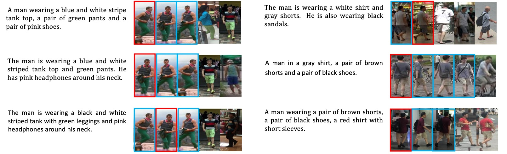

# Weakly Supervised Text-based Person Re-Identification

**Note:** We have open-sourced the trained model and the code necessary to the inference part, based on which you can easily reproduce the performance reported in the paper under a weakly supervised setting.

## Retrieval Results on the CUHK-PEDES dataset 



## Requirement   
* Python 3.5 
* Pytorch 1.0.0 & torchvision 0.2.1
* numpy
* scipy 1.2.1 

## Data Preparation

- For downloading the CUHK-PEDES dataset, please follow [link](https://github.com/ShuangLI59/Person-Search-with-Natural-Language-Description). 
- Following [CMPL](https://github.com/labyrinth7x/Deep-Cross-Modal-Projection-Learning-for-Image-Text-Matching), download the pre-computed/pre-extracted data from [GoogleDrive](https://drive.google.com/file/d/1CGoZdqSlO9m2Er57bAQPoJwOSsrc54y-/view?usp=sharing).

## Testing

1. Download the trained model from [Google Drive](https://drive.google.com/file/d/1ctApJgcY8scxpNlVtmXgbj2z3im6fuDv/view?usp=sharing).

2. Conduct the blow command:

```
sh scripts/run_test_res.sh
```

The result should be around:

   ```Shell
   top-1 = 57.10%
   top-5 = 78.14%
   top-10 = 85.23%
   ```

## Citation

If you find this work useful in your research, please consider citing:
```
@InProceedings{Zhao_2021_ICCV,
    author    = {Zhao, Shizhen and Gao, Changxin and Shao, Yuanjie and Zheng, Wei-Shi and Sang, Nong},
    title     = {Weakly Supervised Text-Based Person Re-Identification},
    booktitle = {Proceedings of the IEEE/CVF International Conference on Computer Vision (ICCV)},
    year      = {2021},
}
```

## Acknowledgement

Our code is largely based on [CMPL](https://github.com/labyrinth7x/Deep-Cross-Modal-Projection-Learning-for-Image-Text-Matching), and we thank the authors for their implementation. Please also consider citing their wonderful code base. 

```
@inproceedings{ying2018CMPM,
    author = {Ying Zhang and Huchuan Lu},
    title = {Deep Cross-Modal Projection Learning for Image-Text Matching},
    booktitle = {ECCV},
    year = {2018}}
```
